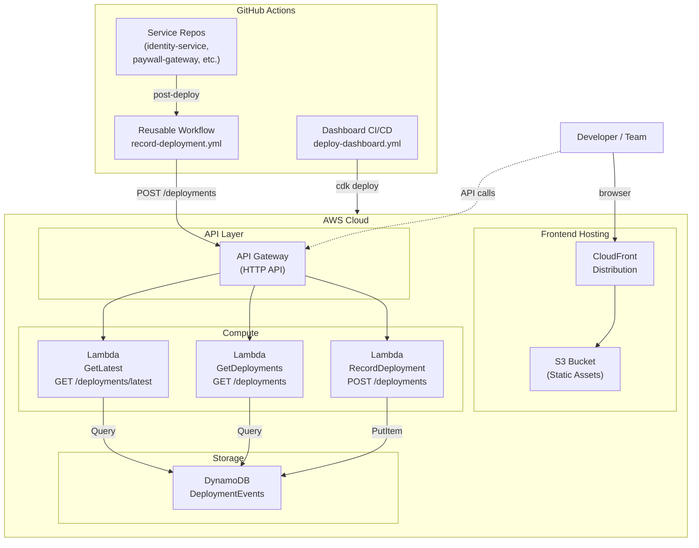

# Deployment Dashboard

A real-time deployment tracking dashboard that gives cct teams visibility into which release versions are deployed across environments, when they were deployed, and by whom.

Built with React, AWS serverless services, and GitHub Actions.

## Features

- **Deployment Matrix** — At-a-glance grid showing the latest deployed version per service and environment (SIT, UAT, PROD)
- **Release Notes** — View changelogs for any deployment directly from the matrix
- **Chronological Log** — Time-ordered feed of all deployment events across services
- **Filtering** — Filter by environment and/or repository
- **Automated Ingestion** — Reusable GitHub Actions workflow that any repo can call post-deploy to record events

## High-Level Architecture



### Data Flow

1. **Ingestion** — When a service repo (ex: auth0-deploy, rampart etc) deploys, its GitHub Actions workflow calls the reusable `record-deployment.yml` workflow, which POSTs the deployment event (repo, environment, version, deployer, timestamp, release notes) to the API Gateway endpoint.

2. **Storage** — The `RecordDeployment` Lambda validates the payload and writes it to DynamoDB :
   - **Primary key**: `REPO#<name>` + `ENV#<env>#<timestamp>` — enables per-repo, per-environment queries
   - **GSI**: `ALL_DEPLOYMENTS` + `<timestamp>` — powers the chronological deployment log
   - **TTL**: 90-day auto-expiry to prevent unbounded growth

3. **Serving** — The React frontend fetches data via two endpoints:
   - `GET /deployments/latest` — Returns the latest deployment per repo+env (12 parallel DynamoDB queries) for the matrix grid
   - `GET /deployments` — Returns a chronological list with optional environment/repo filters for the log view

## Project Structure

```
├── frontend/               React + TypeScript + Vite
│   └── src/
│       ├── components/      DeploymentMatrix, DeploymentLog, FilterBar, ReleaseNotesModal
│       ├── hooks/           useDeployments (data fetching + state)
│       ├── api/             API client functions
│       └── styles/          CSS
│
├── backend/                 AWS Lambda handlers (TypeScript)
│   └── src/
│       ├── handlers/        recordDeployment, getDeployments, getLatestDeployments
│       └── lib/             DynamoDB client, validation, response helpers
│
├── infra/                   AWS CDK (TypeScript)
│   └── lib/
│       ├── api-stack.ts     DynamoDB + Lambda + API Gateway
│       └── frontend-stack.ts S3 + CloudFront
│
└── .github/workflows/
    ├── deploy-dashboard.yml      CI/CD for this project
    └── record-deployment.yml     Reusable workflow for service repos
```

## Getting Started

### Prerequisites

- Node.js 20+
- AWS CLI configured with appropriate credentials
- AWS CDK CLI (`npm install -g aws-cdk`)

### Local Development

```bash
# Install dependencies
cd frontend && npm install
cd ../backend && npm install

# Run the frontend dev server (uses mock data when API is unavailable)
cd frontend && npm run dev
```

### Deploying to AWS

```bash
# Build the backend
cd backend && npm run build

# Build the frontend (set API URL from your deployed stack)
cd frontend && VITE_API_URL=https://your-api-id.execute-api.ap-southeast-2.amazonaws.com npm run build

# Deploy all stacks
cd infra && npm install && npx cdk deploy --all
```

### Integrating with Service Repos

Add this job to any service repo's deploy workflow:

```yaml
record-deploy:
  needs: deploy
  uses: <your-org>/Github_Dashboard/.github/workflows/record-deployment.yml@main
  with:
    repo_name: identity-service
    environment: PROD
    version: ${{ github.ref_name }}
    deployer: ${{ github.actor }}
    commit_sha: ${{ github.sha }}
    release_notes_url: https://github.com/${{ github.repository }}/releases/tag/${{ github.ref_name }}
  secrets:
    API_URL: ${{ secrets.DEPLOY_DASHBOARD_API_URL }}
    API_KEY: ${{ secrets.DEPLOY_DASHBOARD_API_KEY }}
```

### Required GitHub Secrets

| Secret | Scope | Description |
|--------|-------|-------------|
| `AWS_ROLE_ARN` | Dashboard repo | IAM role ARN for CDK deployments (OIDC) |
| `DEPLOY_DASHBOARD_API_URL` | Organization | API Gateway endpoint URL |
| `DEPLOY_DASHBOARD_API_KEY` | Organization | API key for POST authentication |
